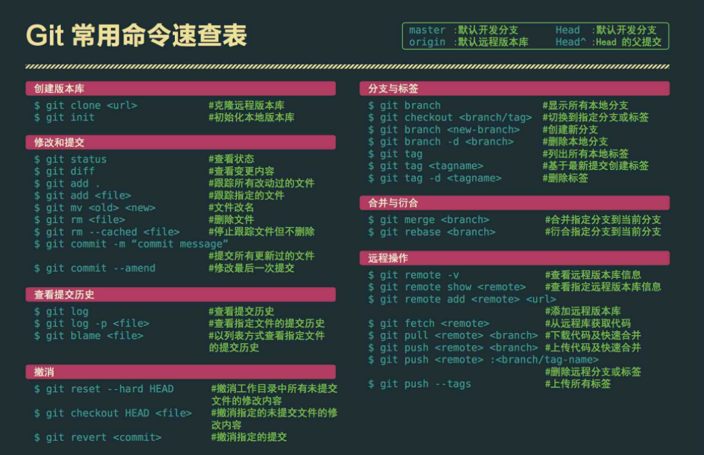
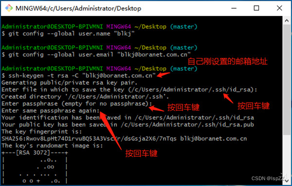
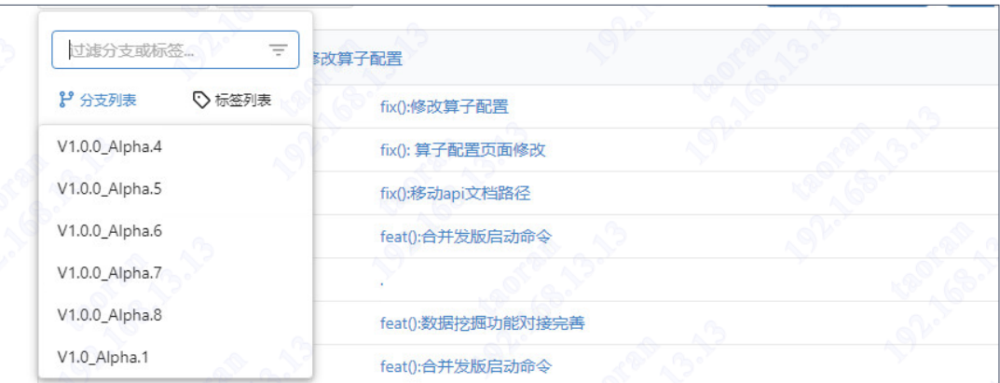
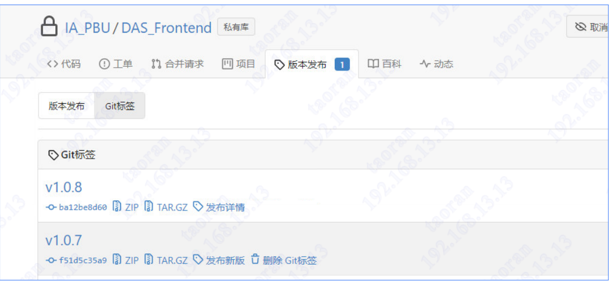
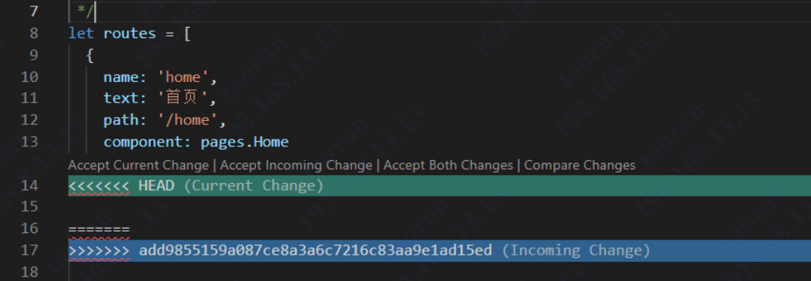

# 解决git命令行不显示中文问题 
git config --global core.quotepath false
# 切换分支 git checkout 分支 
# git  add:将工作区的内容提交的暂存区
# 参看工作区和已暂存文件 git status -s
# 本地连接远程代码仓库
①新建项目目录，进入目录，右键选择  
git bash here    
②初始化git目录   
git init
## ①配置git全局config属性
```
git config --global user.name 'developWangYF' 全局配置用户名           
git config --global user.password '密码' 全局配置密码  
git config --global user.email '----@163.com' 全局配置邮箱  
git config --global core.ignorecase false 设置大小写敏感          

设置不自动转码（很重要，否则windows上传的sh文件在linux里面运 行报错）：
   git config --global core.autocrlf false
   git config --global core.filemode false
   git config --global core.safecrlf true
注：此处可以设置git config 全局配置，只需设置一次，在其他项目中不需要再次设置。
```
## ②本地远程连接github版本库，需根据用户注册邮箱生成ssh私钥
1. 生产ssh私钥
    ```
    ssh-keygen -t rsa -C “blkj@boranet.com.cn”
    ```
    
2. 登录GitHub，点击右上角进入设置，选择 “SSH/GPG秘钥” 的选项。在管理SSH秘钥中，增加秘钥。用文本工具打开之前生成的id_rsa.pub文件，将秘钥复制粘贴进去，ssh秘钥就配置完成。
## ③和远程仓库建立连接
git remote add origin 链接地址
## ④拉取项目到本地
git pull origin develop
## ⑤比较本地代码与仓库的区别
git status /git status -s
## ⑥每次提交代码前都要拉取项目到本地
git pull origin 你想要拉取得分支
## ⑦将工作区修改的代码全部提交到暂存区
git add .
## ⑧git commit -m ‘feat(): 增加某某功能’ 本次暂存区提交内容备注
## ⑨将修改提交到远程仓库
git push origin develop 可以指定分支  
注：分支要指定好，一般不提交master分支
<br>
<br>
<br>
<br>

# 远程创建新分支
1. 查看远程和本地所有分支：
    git branch -a 
2. ①仅创建本地分支  
    ```git
    git branch 新分支名  
    ```
    ②在本地创建新分支并跳转到分支  
    ```git
    git checkout -b 新分支名  
    ```
3. 先跳转到新分支，为远程版本库创建连接
    ```git
    git push origin 新分支名
    ```
4. 将本地创建的分支与远程分支进行关联
    git branch --set-upstream-to=origin/新分支名
5. 查看本地分支与远程分支的映射关系
    git branch -vv

6. 拉取、提交、推送  
    1. git add .     
    2. git  commit -m "备注信息"       
    3. git push origin develop
<br>
<br>
<br>
<br>

# 提交说明
项目一般有3个分支
1. develop用于平常开发代码上传或线上修复bug回传。全新的项目直接上传到develop分支就可以。
2. master用于代码发版时打包的，一般不直接上传代码到master，发版时合并develop中的代码。
3. feature 用于项目迭代，比如一个项目已经发版了，又开了个迭代，新迭代的代码需要上传到feature分支，开发完成后合并到develop分支，再合并到master分支。
项目提测前，需要从develop中创建新的标签，每轮提测都需要创建标签，并规范命名：版本号_Alpha.序号：  

重复此步骤，直至出具测试报告。将develop合并到master发版至v1.0.0，同时也需要将打包后的代码上传至该标签版本上。

# 提交备注规范
例如：git commit -m 'feat(): 新增功能'  
注意冒号后面有空格，不能以大写字母开头；  
包括三个字段：type（必需）、scope（可选）和subject（必需）；
```
type：用于说明 commit 的类型；  

scope：可以省略；用于说明 commit 的影响范围，比如数据层、控制层、视图层等等，视项目不同而不同；

subject：commit 目的的简短描述，不超过50个字符；
    Type类型解释: 
    "docs", ## 仅仅修改了文档，比如README等等
    "chore", ## 改变构建流程、或者增加依赖库、工具等
    "feat", ## 新增feature
    "fix", ## 修复bug
    "merge", ## Merge branch
    "perf", ## 优化相关，比如提升性能、体验
    "refactor", ## 代码重构，没有加新功能或者修复bug
    "revert", ## 回滚到上一个版本 
    "style", ## 仅仅修改了空格、格式缩进、逗号等等，不改变代码逻辑 
    "test" ## 测试用例，包括单元测试、集成测试等
```
注意：  
提测版本从develop打分支tag；  
删除分支时，注意保留分支之前记录；  
当需要发版时将代码合并于master;  
release bugfix feature分支，完成工作后直接删除；


# 合并分支 解决分支不一致问题
develop修改的内容合并到main，可以看到合并成功：
git checkout main
git merge develop
**合并后合并内容文件不会出现在工作区，需要为工作区加入一个更新文件，在新提交改工作区文件的同时把合并内容提交到远程仓库**

# 代码冲突解决
更新代码一般会有一下三种情况：  
对同一项目的不同文件进行了修改  
对同一项目的同一文件的不同区域进行了修改  
对同一项目的同一文件的同一区域进行了不同修改  
1. 合并本质上可以理解为将两或者多个人（分支）对项目的基础的修改整合到一块，注意是对项目的
修改。上述三种情况的前两种是两个人对项目的不同区域进行修改，互不干扰，所以Git可以自动
的将两个人对项目的修改整合到一起
2. 当Git不知道该保留两个修改中的哪一个时，就需要人来进行这个决策，可以选择保留两个修改中
的任意一个，或是选择将两个修改全部保留。完成上述决策就是手动合并的目的。
3. 对于第三种情况，需要手动对内容区进行更改：



# git的回滚

1.回退已经push到远程分支的代码

$ git reset --hard HEAD^ 回退到上个版本
$ git reset --hard HEAD~n n代表会推到n次前的操作
$ git reset --hard commit_id 进入指定commit的
2.强制推送到远程分支

$ git push origin HEAD --force
3.回滚某次操作

$ git revert commit_id  撤回某一次操作，会生成一条新的操作记录，进入编辑行，编辑完后，使用:wq保存退出即可。
4.撤销本地未提交合并

$ git merge --abort
