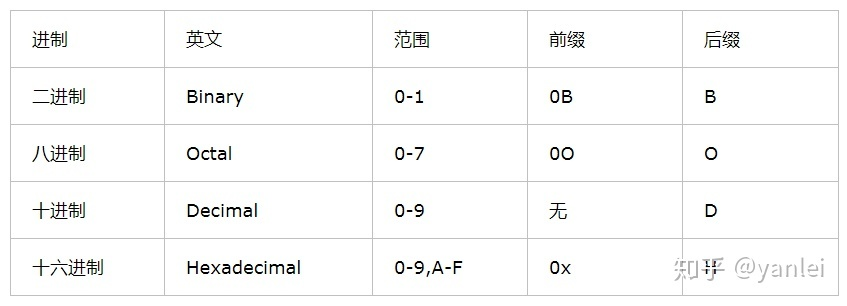
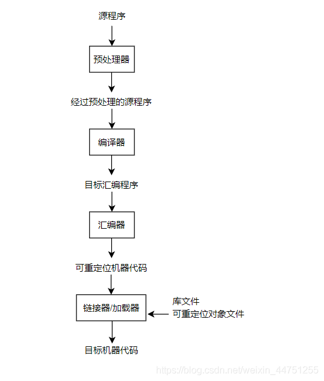
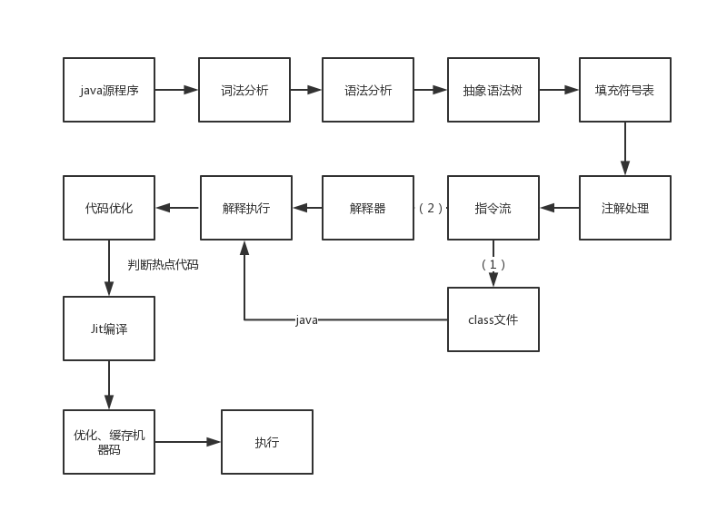
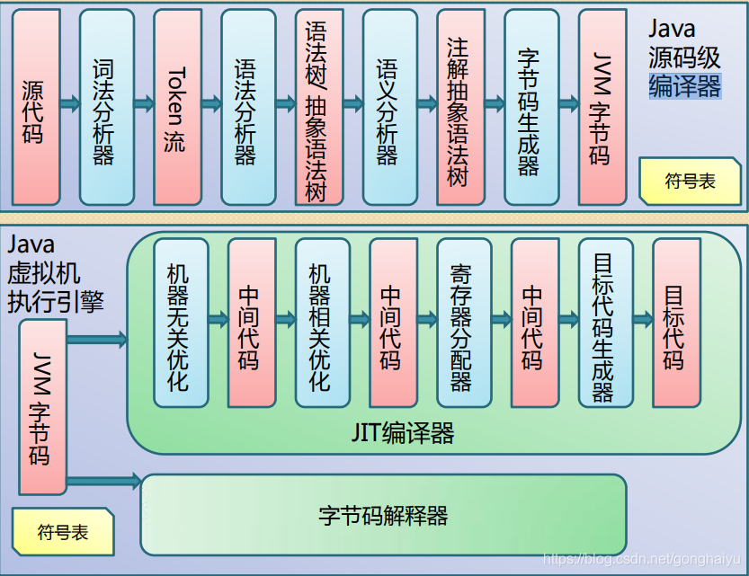
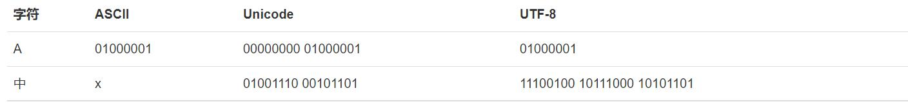

# 学习文档（https://www.liaoxuefeng.com/wiki/1016959663602400 廖雪峰）

# 常识篇
## 字节Byte 和比特 bit 的换算关系是 1 Byte = 8 bit 字节码是由十六进制组成，两个十六进制1字节，8个二进制1字节。
1GB=1024MB 1MB=1024KB 1KB=1024Bit 1Bit=1024节
1字节=8bit=8个0b二进制(0~255)=2个0x十六进制(两位的十六进制数值最大是0xFF，换成十进制就是：255)=0~255
一个字节能表示的最大的整数就是255（二进制11111111=十进制255）
## 进制类型
1. 0B 表示二进制的前缀 这个它是以ob开头后面的数字都是二进制数 即:全部都是0和1  
例如:0B10101010111 或者 0b10101010111

2. 0O 表示八进制的前缀 也可以使用0表示八进制的前缀
3. 十进制的后缀 大家常见的数字不就是十进制数吗 怎么想的
没有前缀也没有后缀 就是数字表示多少就是多少

4. 0x 这个是十六进制的前缀  
0x是16进制的前缀，H是16进制的后缀
都是表示十六进制数，意义上没有什么区别，完全相等。  
至于什么时候用0x，什么时候用H，这取决于你在什么环境下使用，如果在C/C++/C#，必须用0x来表示。
在C/C#语言中是不能用H的.


## bytes python的二进制类型数据 bytes 也是不可变序列。
bytes 保存的就是原始的字节（二进制格式）数据，因此 bytes 对象可用于在网络上传输数据，也可用于存储各种二进制格式的文件，比如图片、音乐等文件。
# python简介

python是一种强类型(不允许不同类型相加)、解释型的动态编程语言,包含对象、模块、线程、异常和自动内存管理。具有可移植性(pyc文件可跨平台运行)、可扩展性（多种多样得库封装）、内置数据结构（）
## 解释型语言与编译型语言
&emsp;&emsp;PHP、Ruby、Python、JavaScript是解释型语言，C、c++、c#、Scala、java、go是编译型语言
&emsp;&emsp;解释型语言，由解释器将代码逐行转换成机器码执行。  
&emsp;&emsp;编译型语言，由编译器将代码整体转化成过渡字节码，由编译器将字节码编译为机器码，可部署到各种平台上执行。  
（使用JavaScript编写的代码不需要编译,可直接运行,浏览器会直接解释源代码,并执行在内存中创建变量等操作。）

## 动态语言与静态语言 弱类型与强类型语言
### 动态语言
是运行时才确定数据类型的语言，变量在使用之前无需申明类型，通常变量的值是被赋值的那个值的类型。比如**Php、Asp、JavaScript、Python、Perl等等**。  
动态语言只在程序运行期间才去进行数据类型检查，分配内存。  
动态类型语言虽然快速灵活，但在代码运行前很难找到bug，所以提升了开发速度，但失去程序的健壮性。  

### 弱类型语言
是数据类型可以被忽略的语言。一个变量可以赋不同数据类型的值。一个变量的类型是由其上下文决定的，效率更高。  
弱类型：允许不同类型相加。

### 静态语言
是编译时变量的数据类型就可以确定的语言，大多数静态语言要求在使用变量之前必须声明数据类型。比如**Java、C、C++、C#等。**  

### 强类型语言
是必须强制确定数据类型的语言，一旦一个变量被指定了某个数据类型，如果不经过强制转换，那么它就永远是这种数据类型,不允许隐式的类型转换。一个变量的类型是申明的时候就已经确定的，更安全。  
静态类型语言在使用变量之前，需要为它们分配好内存。
强类型：不允许不同类型相加
### 动态语言与静态语言的区别
静态语言由于强制声明数据类型，让开发工具（IDE）对代码有很强的判断能力，在实现复杂的业务逻辑和开发大型商业系统、以及那些声明周期很长的应用中，开发者可以依托强大的IDE来更高效、更安全地开发。  
动态语言思维不受约束，可以任意发挥，把更多的精力放在产品本身上；集中思考业务逻辑实现，思考过程就是实现过程。  

## 编程思想（面向对象、面向过程、函数式）
常见的编程方式有三种：

1）面向过程：根据业务逻辑从上到下写垒代码，最常见的操作就是粘贴复制，将之前实现的代码块复制到现需功能处。

2）函数式：将某功能代码封装到函数中，日后无需重复编写，仅调用函数即可。

3）面向对象：对函数进行分类和封装，让开发变得更快更好更强。

相比于Java和C#这种只支持面向对象编程的语言，python更加灵活，既支持面向过程编程，也支持函数式编程和面向对象编程。

## 编译器与解释器
&emsp;&emsp;编译器  
&emsp;&emsp;简而言之，编译器就是一个程序，可以阅读以某一种语言（即源语言）编写的程序，并把该程序翻译成一个等价的、用另一种语言（即目标语言）编写的程序。  
&emsp;&emsp;解释器  
&emsp;&emsp;解释器是另一种常见的语言处理器，它并不通过翻译的方式生成目标程序。从用户的角度看，解释器直接利用用户提供的输入，执行源程序中的指定操作，产生输出。  
### 编译器与解释器的区别
&emsp;&emsp;让我们看看编译器和解释器之间的主要区别  
* 1、编译器将一个程序作为一个整体进行翻译，而解释器则一条一条地翻译一个程序
* 2、在编译器的情况下生成中间代码或目标代码。而解释器不创建中间代码
* 3、编译器比解释器要快得多，因为编译器一次完成整个程序，而解释器则是依次编译每一行代码
* 4、由于要生成目标代码，编译器比解释器需要更多的内存
* 5、编译器同时显示所有错误，很难检测错误，而解释器则逐个显示每条语句的错误，更容易检测错误
* 6、在编译器中，当程序中出现错误时，它会停止翻译，并在删除错误后重新翻译整个程序。相反，当解释器中发生错误时，它会阻止其翻译，在删除错误后，翻译将继续
* 7、在编译器中，这个过程需要两个步骤，首先将源代码翻译成目标程序，然后执行。而在解释器中，这是一个一次性的过程，源代码在编译和执行的同时
* 8、编译器用于编程语言，如C、c++、c#、Scala、java等。另一个解释器用于PHP、Ruby、Python等语言。

## 字节码与汇编程序
### 汇编编译
c、go等语言经过编译器（gcc）将程序代码，转换成中间语言汇编程序(.s),再有加工得到可执行文件（go经汇编器处理、
compile（得.o）与link拼接成二进制可执行文件）（c经汇编器处理(得.o)、经连接器得可执行文件.exe/.out）。
### 字节码编译
java、python、JavaScript等语言经过编译器（cpython解释器/javac解释器），经编译器可得字节码文件（.class/.pyc）。

字节码为跨端部署应用硬件资源封装了一层，不用对各种硬件配置进行单独调整，由解释器或JVM（虚拟机）语义分析字节码成机器码执行。

为什么编译器不直接编译成机器码（CPU硬件指令）而编译成软件模拟实现的字节码呢？
编译和执行字节码会带来很多好处：
* 1、软件能最大限度的跨平台，因为所有芯片都跑的同一套“软件模拟指令系统”，这屏蔽了不同CPU的硬件指令差异，所以会有一次编译到处运行的好处。
* 2、其实直接解释语法分析树，也是可以做到代码跨平台的，很多简单初期的脚本语言就是直接解释语法分析书，直接解释执行，但这样效率低，也很费内存（早期的timscript就是直接解释语法分析树），生成字节码，在解释执行字节码就快很多，因为编译器通过遍历语法分析树，把所有的必要信息已经固化了，不用每执行一步都去遍历一下分析树，，，当然这还是不如CPU的硬件指令快。
* 3、字节码对于编译器和虚拟机的制作而言，就简单很多了，还是不用考虑各芯片平台的指令差异，硬件指令的优化差异，虚拟机通过微调就能移植到各种芯片上跑起来。  
其实字节码就是对应CPU机器码，执行效率低，但是又比直接执行语法分析树效率高很多，所以自然就流行开了。

## 反汇编与反编译（逆向工程）
对未加密编译生产得中间文件（汇编程序、字节码）都能进行反编译(反汇编)得到源代码

## 语言处理系统
如图，在创建一个可执行的目标程序时，除了编译器之外，还需要一些其他程序。  

一个源程序可能被分割成多个模块，存放在独立的文件中。

* 预处理器（preprocessor）：把源程序聚合在一起：把称为宏的缩写形式转换为源语言的语句。

* 编译器：将经过预处理的源程序作为输入，产生一个汇编语言程序作为其输出。

* 汇编器（assembler）：处理汇编语言程序，生成可重定位的机器代码。

  大型程序经常被分成多个部分进行编译，因此，可重定位的机器代码必须和其他可重定位的目标文件以及库文件连接到一起，形成真正的在机器上运行的代码。

* 链接器（linker）：将多个可重定位的机器代码文件（包括库文件）连接到一起。一个文件中的代码可能指向另一个文件中的位置，而链接器可以解决外部内存地址问题。

* 加载器（loader）：修改可重定位地址，将修改后的指令和数据放到合适的位置。
### 语言处理器种类
编译器，如gcc、javac解释器。
如Ruby、Python等一些一些语言使用解析器来实现的。
IDE，如Eclipse、NetBeans等。
代码分析器，如FindBugs等。
反编译器，如JD、Jad、Reflector.NET等。
### c的编译器将C程序源代码转换为二进制分为四步：
预处理、编译、汇编、链接

* 1、预处理：预编译动作，比如宏、static成员等都在这个阶段处理；（Unix：.i）

* 2、编译：生成汇编文件，此过程编译器会对源码进行优化；（Unix：.s）

* 3、汇编：将汇编文件生成目标文件，其实已经是可执行的了（Unix：.o Win：.obj)；

* 4、链接：将目标文件链接成一个可执行文件（Unix：.out Win：.exe)。

### go的编译器将go程序源代码转换为二进制：
Go语言在1.5版本实现自举。Go语言在1.5版本之前使用c实现的编译器，在1.5版本时候使用Go实现了自己的编译器  
build命令编译hello.go文件
执行go build hello.go，目录下生成可执行文件hello(二进制)。执行hello，输出Hello World。
```go
$ go help build
...
 
-n 不执行地打印流程中用到的命令
-x 执行并打印流程中用到的命令，要注意下它与-n选项的区别
-work 打印编译时的临时目录路径，并在结束时保留。默认情况下，编译结束会删除该临时目录。
```
```go
$ go build -n hello.go
#
# command-line-arguments
#
 
mkdir -p $WORK/b001/
cat >$WORK/b001/importcfg << 'EOF' # internal
# import config
packagefile fmt=/usr/local/go/pkg/darwin_amd64/fmt.a
packagefile runtime=/usr/local/go/pkg/darwin_amd64/runtime.a
EOF
cd /Users/polo/Public/Work/go/src/study/basic/hello
/usr/local/go/pkg/tool/darwin_amd64/compile -o $WORK/b001/_pkg_.a -trimpath $WORK/b001 -p main -complete -buildid fVbBEz0nTJc3r6VxU5ye/fVbBEz0nTJc3r6VxU5ye -goversion go1.11.1 -D _/Users/polo/Public/Work/go/src/study/basic/hello -importcfg $WORK/b001/importcfg -pack -c=4 ./hello.go
/usr/local/go/pkg/tool/darwin_amd64/buildid -w $WORK/b001/_pkg_.a # internal
cat >$WORK/b001/importcfg.link << 'EOF' # internal
packagefile command-line-arguments=$WORK/b001/_pkg_.a
 
...
 
packagefile internal/race=/usr/local/go/pkg/darwin_amd64/internal/race.a
EOF
mkdir -p $WORK/b001/exe/
cd .
/usr/local/go/pkg/tool/darwin_amd64/link -o $WORK/b001/exe/a.out -importcfg $WORK/b001/importcfg.link -buildmode=exe -buildid=P1Y_fbNXAEG6zEEGqFsM/fVbBEz0nTJc3r6VxU5ye/fVbBEz0nTJc3r6VxU5ye/P1Y_fbNXAEG6zEEGqFsM -extld=clang $WORK/b001/_pkg_.a
/usr/local/go/pkg/tool/darwin_amd64/buildid -w $WORK/b001/exe/a.out # internal
mv $WORK/b001/exe/a.out hello
```
过程看起来很乱，仔细观看下来可以发现主要由几部分组成，分别是：
* 创建临时目录，mkdir -p $WORK/b001/;
* 查找依赖信息，cat >$WORK/b001/importcfg << ...;
* 执行源代码编译，/usr/local/go/pkg/tool/darwin_amd64/compile ...;
* 收集链接库文件，cat >$WORK/b001/importcfg.link << ...;
* 生成可执行文件，/usr/local/go/pkg/tool/darwin_amd64/link -o ...;
* 移动可执行文件，mv $WORK/b001/exe/a.out hello;

过程和c程序的编译是大同小异：预处理->编译->链接。表现为显示过程就是compile与link  

compile简单来说将同一个package的多个文件编译成一个.o文件。大致过程可概括为：  
解析文件->解析语法->类型检查->编译->写入文件  
link工具负责将.o目标文件与其他对象组合成一个包档案或直接传给连接器(在上一章的c中动态链接也是靠链接器完成的)，并将其组合到可执行的二进制文件中  
### java编译过程
Java文件编译过程包括两个阶段:  
* 第一阶段是在编译阶段编译成Java字节码的过程，有些书籍中叫前端编译器，如Oracle的javac编译器；
* 第二阶段是在运行时，通过JVM的编译优化组件，对代码中的部分代码编译成本地代码，即JIT编译，如HotSpot中的C1、C2编译器。JVM整个编译过如下图所示。


```java
    //编译状态 
    public enum CompileState {
            INIT(0),//初始化
            PARSE(1),//解析
            ENTER(2),//处理符号表
            PROCESS(3),//核心处理
            ATTR(4),//符号解析
            FLOW(5),//流分析
            TRANSTYPES(6),//解泛型为非泛型等类型转换
            UNLAMBDA(7),//解LAMBDA表达式
            LOWER(8),//解语法糖
            GENERATE(9);//生成字节码
    }
 ```

JIT编译器和C1（C2）编译器编译流程如图所示：  



## python的优缺点（缺点同样是解释性语言的缺点）
python第一个缺点就是运行速度慢  
和C程序相比非常慢，因为Python是解释型语言，你的代码在执行时会一行一行地翻译成CPU能理解的机器码，这个翻译过程非常耗时，所以很慢。而C程序是运行前直接编译成CPU能执行的机器码，所以非常快。  
java通过编译器将代码编译成class字节码，可JVM中不同类型的解释器编译成他特定的机器码（机器码指计算机能理解的语言，不同的计算机有需要的机器码）  
第二个缺点就是代码不能加密。如果要发布你的Python程序，实际上就是发布源代码，这一点跟C语言不同，C语言不用发布源代码，只需要把编译后的机器码（也就是你在Windows上常见的xxx.exe文件）发布出去。要从机器码反推出C代码是不可能的，所以，凡是编译型的语言，都没有这个问题，而解释型的语言，则必须把源码发布出去。

### java发布程序加密
虚拟化保护支持jar/war及支持jar调用加密,防止代码被反编译,支持多平台部署.  
对Java项目加密有两种方式,一种是对War包加密,一种是对Jar包加密
### C#发布程序加密
c语言将程序编译为exe文件不可反编译

### golang
go语言是一种静态强类型、编译型、并发型，并具有垃圾回收功能的编程语言。


## python的解释器 
### 注意（因为编译器编译代码并生成字节码。 之后,解释器将字节码转换为机器可理解的代码。） 
python语言从开发规范到解释器都是开源的  
所以理论上，只要水平够高，任何人都可以编写Python解释器来执行Python代码
### CPython
安装官方python3.x以后的版本，我们就直接获得一个官方版本的解释器：CPython,顾名思义它是C语言开发的
### IPython
IPython是基于CPython之上的一个交互式解释器，也就是说，IPython只是在交互方式上有所增强，但是执行Python代码的功能和CPython是完全一样的。好比很多国产浏览器虽然外观不同，但内核其实都是调用了IE。
CPython用>>>作为提示符，而IPython用In [序号]:作为提示符。
### PyPy 学习文档（https://doc.pypy.org/en/latest/introduction.html ）
PyPy是另一个Python解释器，它的目标是执行速度。
PyPy采用JIT-即时编译技术，对Python代码进行动态编译（注意不是解释），所以可以显著提高Python代码的执行速度。

绝大部分Python代码都可以在PyPy下运行，但是PyPy和CPython有一些是不同的，这就导致相同的Python代码在两种解释器下执行可能会有不同的结果。如果你的代码要放到PyPy下执行，就需要了解PyPy和CPython的不同点。
#### PyPy 使用python语言的子集RPython实现的解释器，一般情况下PyPy比CPython快4.2倍


### Jython、IronPython
Jython是运行在Java平台上的Python解释器，可以直接把Python代码编译成Java字节码执行。  
IronPython是运行在微软.Net平台上的Python解释器，可以直接把Python代码编译成.Net的字节码。  
如果要和Java或.Net平台交互，最好的办法不是用Jython或IronPython，而是通过网络调用来交互，确保各程序之间的独立性。  
### Pyston web加速运行
Pyston 一个较新的实现，是CPython 3.8.8的一个分支，具有其他针对性能的优化。它针对大型现实应用程序（例如Web服务），无需进行开发工作即可提供高达30％的加速。

### Stackless Python 带有协程实现的解释器
## python基础概念
* IPython && Jupyter ipython是使用python构建的交互式shell, Jupyter是其web化的包装。
* Anaconda 是一个python虚拟环境，Python数据科学常用。
* mypyc 一个新的项目，将python编译成c代码库，以期提高python的运行效率。
* py文件和pyc文件 pyc文件是python编译后的字节码，也可以由python解释器执行。
* wheel文件和egg文件 都是项目版本发布的打包文件，wheel是最新标准。
* 机器码指计算机能理解的语言，不同的计算机有需要的机器码

* .....


## python缺点的解决方案
### python在编译语言和解释语言之间横跳
py文件编译成pyc后，解释器默认 优先 执行pyc文件，这样可以加快python程序的 启动速度 (注意是启动速度)。继背叛弱类型语言后，python这个鬼又在编译语言和解释语言之间横跳。

### 加速编译
mypyc 一个新的项目，将python编译成c代码库，以期提高python的运行效率。

Pyston 一个较新的实现，是CPython 3.8.8的一个分支，具有其他针对性能的优化。它针对大型现实应用程序（例如Web服务），无需进行开发工作即可提供高达30％的加速。

pypy 通过JIT-即时编译技术加速编译 web加速  
pypy使用python的子集rpython实现了解释器，和前面介绍的Go的自举有点类似。反常识的是rpython的解释器会比cpython实现的解释器快？主要是因为pypy使用了JIT技术。  

Just-In-Time (JIT-即时编译技术) Compiler 试图通过对机器码进行一些实际的编译和一些解释来获得两全其美的方法。简而言之，以下是JIT编译为提高性能而采取的步骤：  

* 标识代码中最常用的组件，例如循环中的函数。
* 在运行时将这些零件转换为机器码。
* 优化生成的机器码。
* 用优化的机器码版本交换以前的实现。

这也是 “pypy为什么能让python比cpython还快” 一文中的示例展现出来的能力。pypy除了速度快外，还有下面一些特点:
* 内存使用情况比cpython少
* gc策略更优化
* Stackless 协程模式默认支持，支持高并发
* 兼容性好，高度兼容cpython实现，基本可以无缝切换

pypy这么强，快和省都占了，为什么没有大规模流行起来呢? 我个人认为，主要还是python的原因。

python生态中大量库采用c实现，特别是科学计算/AI相关的库，pypy在这块并没有优势。pypy快的主要在pure-python，也就是纯粹的python实现部分。  
pypy适合长驻内存的高并发应用（web服务类）  
python是一门胶水语言，并不追求性能极致，即使比cpython快4倍也不够快。
需要注意的是，pypy一样也有GIL的存在, 所以高并发主要在stackless。
```
GIL 全称：全局解释器锁(Global Interpreter Lock)，是计算机程序设计语言解释器用于同步线程的一种机制，它使得任何时刻仅有一个线程在执行。即便在多核处理器上，使用 GIL 的解释器也只允许同一时间执行一个线程，常见的使用 GIL 的解释器有 CPython 与 Ruby MRI。GIL 并不是 Python 独有的特性，是解释型语言处理多线程问题的一种机制而非语言特性。

　　GIL 本质是一把互斥锁，与其他所有互斥锁的本质一样，都是将并发运行变成串行，以此来控制同一时间内共享数据只能被一个任务所修改，进而保证数据安全。可以肯定的一点是：保护不同的数据的安全，就应该加不同的锁。
```
如果项目纯python部分较多，推荐尝试使用pypy运行程序。

## python的静态分析工具 离线分析python代码(cmd运行:pychecker x.py /pylint x.py)
PyChecker是Python代码的静态分析工具，它能够帮助查找Python代码中的bug，而且能够对代码的复杂度和难度提供警告。**只适合python2中几个版本**  

Pylint是一个高阶的Python代码分析工具，它分析Python代码中的错误，查找不符合代码风格标准（Pylint 默认使用的代码风格是 PEP 8）和有潜在问题的代码。目前 Pylint 的最新版本是 pylint-1.2.1。可以检查一行代码的长度、变量名是否符合规范等。运行两次可以看出代码是否改进，分数是否有所提高，10分满分。**适合分析python2.5以上版本代码**  


## python基础语法 
缩进与注释#与代码块:
以#开头的语句是注释，注释是给人看的，可以是任意内容，解释器会忽略掉注释。其他每一行都是一个语句，当语句以冒号:结尾时，缩进的语句视为代码块。  
缩进有利有弊。好处是强迫你写出格式化的代码，但没有规定缩进是几个空格还是Tab。按照约定俗成的惯例，应该始终坚持使用4个空格的缩进。  
缩进的另一个好处是强迫你写出缩进较少的代码，你会倾向于把一段很长的代码拆分成若干函数，从而得到缩进较少的代码。
## 数据类型
整数  
计算机由于使用二进制，所以，有时候用十六进制表示整数比较方便，十六进制用0x前缀和0-9，a-f表示，例如：0xff00，0xa5b4c3d2，等等。    
对于很大的数，例如10000000000，很难数清楚0的个数。Python允许在数字中间以_分隔，因此，写成10_000_000_000和10000000000是完全一样的。十六进制数也可以写成0xa1b2_c3d4

浮点数  
浮点数也就是小数，之所以称为浮点数，是因为按照科学记数法表示时，一个浮点数的小数点位置是可变的，比如，1.23x109和12.3x108是完全相等的。浮点数可以用数学写法，如1.23，3.14，-9.01，等等。但是对于很大或很小的浮点数，就必须用科学计数法表示，把10用e替代，1.23x109就是1.23e9，或者12.3e8，0.000012可以写成1.2e-5，等等。  

**注意：整数和浮点数在计算机内部存储的方式是不同的，整数运算永远是精确的（除法难道也是精确的？是的！），而浮点数运算则可能会有四舍五入的误差。**

除法精确：  

<br>  
<br>  

字符串  
转义字符\可以转义很多字符，比如\n表示换行，\t表示制表符，字符\本身也要转义，所以\\表示的字符就是\。  
如果字符串内部有很多换行，用\n写在一行里不好阅读，为了简化，Python允许用'''...'''的格式表示多行内容。  
```python
>>> print('''line1
... line2
... line3''')
line1
line2
line3
```
布尔值
布尔值和布尔代数的表示完全一致，一个布尔值只有True、False两种值，要么是True，要么是False，在Python中，可以直接用True、False表示布尔值（请注意大小写）。布尔值可以用and、or和**not**（意为'非'，与!功能相同取反)运算。  
空值  
空值是Python里一个特殊的值，用None表示。None不能理解为0，因为0是有意义的，而None是一个特殊的空值。 
## 常量与变量
常量  
所谓常量就是不能变的变量，比如常用的数学常数π就是一个常量。在Python中，通常用全部大写的变量名表示常量：  
PI = 3.14159265359  
但事实上PI仍然是一个变量，Python根本没有任何机制保证PI不会被改变，所以，用全部大写的变量名表示常量只是一个习惯上的用法，如果你一定要改变变量PI的值，也没人能拦住你。  
**python强制限定常量，常量也是变量**
变量  
变量的概念基本上和初中代数的方程变量是一致的，只是在计算机程序中，变量不仅可以是数字，还可以是任意数据类型。  
a = 'ABC'时，Python解释器干了两件事情：  

* 在内存中创建了一个'ABC'的字符串；
* 在内存中创建了一个名为a的变量，并把它指向'ABC'。


## 字符串编码问题
### ASCII编码(只占一个字节)  
ASCII它是一种7位编码,但它存放时必须占全一个字节,也即占用8位
由于计算机是美国人发明的，因此，最早只有127个字符被编码到计算机里，也就是大小写英文字母、数字和一些符号，这个编码表被称为ASCII编码，比如大写字母A的编码是65，小写字母z的编码是122  
### Unicode字符集  
中文的需要至少两个字节，ASCII编码不够用  
Unicode字符集应运而生。Unicode把所有语言都统一到一套编码里，这样就不会再有乱码问题了。
Unicode标准也在不断发展，但最常用的是UCS-16编码，用两个字节表示一个字符（如果要用到非常偏僻的字符，就需要4个字节）。
### ASCII编码和Unicode编码的区别：ASCII编码是1个字节，而Unicode编码通常是2个字节。
但是，如果你写的文本基本上全部是英文的话，用Unicode编码比ASCII编码需要多一倍的存储空间，在存储和传输上就十分不划算。

### UTF-8编码 优化编码，整合ASCII编码和Unicode编码
UTF-8编码把一个Unicode字符根据不同的数字大小编码成1-6个字节，常用的英文字母被编码成1个字节，汉字通常是3个字节，只有很生僻的字符才会被编码成4-6个字节。如果你要传输的文本包含大量英文字符，用UTF-8编码就能节省空间：

UTF-8编码有一个额外的好处，就是ASCII编码实际上可以被看成是UTF-8编码的一部分，所以，大量只支持ASCII编码的历史遗留软件可以在UTF-8编码下继续工作。
## encode与decode，从网络或磁盘上读取了字节流的转化方法
将编码数据转化为字节流，encode()要把bytes变为str
如果我们从网络或磁盘上读取了字节流，那么读到的数据就是bytes。decode()方法：要把bytes变为str。
```Python
>>> 'ABC'.encode('ascii') #ascii编码
b'ABC'
>>> '中文'.encode('utf-8')
b'\xe4\xb8\xad\xe6\x96\x87'

>>> b'ABC'.decode('ascii')
'ABC'
>>> b'\xe4\xb8\xad\xe6\x96\x87'.decode('utf-8')
'中文'
# 如果bytes中只有一小部分无效的字节，可以传入errors='ignore'忽略错误的字节：
>>> b'\xe4\xb8\xad\xff'.decode('utf-8', errors='ignore')
'中'
```
## 序列化
### pickle模块

* (1)把变量从内存中变成可存储或传输的过程，称之为序列化。Python中pickling，其他语言中也被称为serialization，marshalling，flattening等，都是相同的意思。

* (2)序列化之后，就可以把序列化后的内容(序列化后的内容是一个Bytes)写入磁盘，或者通过网络传输到别的机器上。

* (3)把变量内容从序列化的对象重新读到内存里，称之为反序列化，即unpickling。

* (4)Pickle的问题和所有其他编程语言特有的序列化问题一样，就是它只能用于Python，并且可能不同版本的Python彼此都不兼容，因此，只能用pickle保存那些不重要的数据，不能成功地反序列化也没关系。

```python
d=dict(name='shirley',age=23,score=98)
# pickle.dumps()方法： 把任意对象序列化成一个bytes，然后，通过一定方式把这个bytes写入文件。
print(pickle.dumps(d))
# pickle.dump( )方法： 直接把对象序列化后写入一个file-like Objectimport pickle
f=open('dump.txt','wb')  #因为序列化之后是bytes，所以是wb
pickle.dump(d,f)
f.close()
```

### JSON模块
Python内置的json模块可以实现从Python对象到JSON格式的转换
* (1)JSON表示出来就是一个字符串，可以被所有语言读取，也可以方便地存储到磁盘或者通过网络传输。
* (2)JSON是标准格式，比XML更快，而且可以直接在Web页面中读取。
* (3)JSON表示的对象就是标准的JavaScript语言的对象
```python
d=dict(name='shirley',age=23,score=98)

print(json.dumps(d)) # 将任意python数据类型转化为str类型

print(isinstance(json.dumps(d),str)) #判断序列化后的内容类型

print(type(json.dumps(d)))#判断序列化后的内容类型
json_str = json.dumps(d)
print(json.loads(json_str))

print(type(json.loads(json_str)))
```
## pickle与json模块功能的差别
pickle可将python数据类型与bytes类型数据见相互转化,然而json模块可以将在字典、字符串、json数据类型间相互转换。
Python语言特定的序列化模块是pickle，但如果要把序列化搞得更通用、更符合Web标准，就可以使用json模块。
**json表示为JavaScript语言数据对象**
## 字符串r模式/b模式/f模式
```python
a=r'//a' # 转义字符不起作用
a=b'//a' # 将str类型转为bytes类型数据
a=f'//{a}'# 将变量a带入字符串，后重新把字符串赋予a
```
## 字符串与编码数据相互转换 

### 内置python编码转化函数
Python提供了ord()函数获取字符的整数表示，chr()函数把编码转换为对应的字符：
```python
>>> ord('A')
65
>>> ord('中')
20013
>>> chr(66)
'B'
>>> chr(25991)
'文'
```

## 格式化输出字符串
我们经常会输出类似'亲爱的xxx你好！你xx月的话费是xx，余额是xx'之类的字符串，而xxx的内容都是根据变量变化的，所以，需要一种简便的格式化字符串的方式。
### 占位符
占位符	替换内容
%d	    整数
%f	    浮点数
%s	    字符串
%x	    十六进制整数
```python
print('%2d-%02d' % (3, 1))
```

**如果你不太确定应该用什么，%s永远起作用，它会把任何数据类型转换为字符串。**
### format() 在字符串中按list下标引入变量
另一种格式化字符串的方法是使用字符串的format()方法，它会用传入的参数依次替换字符串内的占位符{0}、{1}……，不过这种方式写起来比%要麻烦得多：
```python
>>> 'Hello, {0}, 成绩提升了 {1:.1f}%'.format('小明', 17.125)
'Hello, 小明, 成绩提升了 17.1%'
```
### f-string 在字符串中引入变量
最后一种格式化字符串的方法是使用以f开头的字符串，称之为f-string，它和普通字符串不同之处在于，字符串如果包含{xxx}，就会以对应的变量替换：
```python
>>> r = 2.5
>>> s = 3.14 * r ** 2
>>> print(f'The area of a circle with radius {r} is {s:.2f}')
The area of a circle with radius 2.5 is 19.62
```
上述代码中，{r}被变量r的值替换，{s:.2f}被变量s的值替换，并且:后面的.2f指定了格式化参数（即保留两位小数），因此，{s:.2f}的替换结果是19.62。

## list[]可变和tuple()不可变 有序数据类型
### list
list是一种有序的集合，可以随时添加和删除其中的元素。  
```python
classmates=['Michael', 'Bob', 'Tracy', 'Adam']
```
尾部追加元素，无返回值  
```python
classmates.append('Adam') 
``` 
在指定位置后面添加元素无返回值  
```python
classmates.insert(1, 'Jack')  
```
要删除list末尾的元素，**有返回值**  
要删除指定位置的元素，用pop(i)方法，其中i是索引位置： 
```python 
classmates.pop()
'Adam'
```
### tuple
有序列表叫元组：tuple。tuple和list非常类似，但是tuple一旦初始化就不能修改，比如同样是列出同学的名字：

                        但是，要定义一个只有1个元素的tuple，如果你这么定义：

                        >>> t = (1)
                        >>> t
                        1
                        定义的不是tuple，是1这个数！这是因为括号()既可以表示tuple，又可以表示数学公式中的小括号，这就产生了歧义，因此，Python规定，这种情况下，按小括号进行计算，计算结果自然是1。

                        所以，只有1个元素的tuple定义时必须加一个逗号,，来消除歧义：

                        >>> t = (1,)
                        >>> t
                        (1,)
                        Python在显示只有1个元素的tuple时，也会加一个逗号,，以免你误解成数学计算意义上的括号。

将元组可变，内部存储list可变
理解了“指向不变”后，要创建一个内容也不变的tuple怎么做？那就必须保证tuple的每一个元素本身也不能变。

## dict{}可变和set{}不可变 无序数据类型
Python内置了字典：dict的支持，dict全称dictionary，在其他语言中也称为map，使用键-值（key-value）存储，具有极快的查找速度。
dict字典(Map)
要避免key不存在的错误，有两种办法，一是通过in判断key是否存在：
```python
>>> 'Thomas' in d
False
```
二是通过dict提供的get()方法，如果key不存在，可以返回None，或者自己指定的value：
```python
>>> d.get('Thomas')
>>> d.get('Thomas', -1)
-1
```
dict内部存放的顺序和key放入的顺序是没有关系的。  

和list比较，dict有以下几个特点：  
查找和插入的速度极快，不会随着key的增加而变慢；  
需要占用大量的内存，内存浪费多。  
### set
set和dict类似，也是一组key的集合，但不存储value。key同样不能重复。
* 要创建一个set，需要提供一个list作为输入集合：
> s = set([1, 2, 3])
* 通过add(key)方法可以添加元素到set中，可以重复添加，但不会有效果：
* 通过remove(key)方法可以删除元素：
* set可以看成数学意义上的无序和无重复元素的集合，因此，两个set可以做数学意义上的交集、并集等操作：
```python
>>> s1 = set([1, 2, 3])
>>> s2 = set([2, 3, 4])
>>> s1 & s2
{2, 3}
>>> s1 | s2
{1, 2, 3, 4}
```
### 对于不变对象来说，调用对象自身的任意方法，也不会改变该对象自身的内容。相反，这些方法会创建新的对象并返回，这样，就保证了不可变对象本身永远是不可变的。

## 函数的定义与调用 参数种类

### 参数种类
共有五种参数种类：
必选参数、默认参数、可变参数、命名关键字参数和关键字参数。
```python
def temp(first,second="Hello World",*args,**kwargs)
    print(first)
    print(second)
    print(args)
    print(kwargs)
 ```
* 1、参数first称为位置参数

* 2、参数second称为默认参数

* 3、参数*args称为可变参数

* 4、参数**kwargs也称为可变参数

参数定义的顺序必须是：必选参数、默认参数、可变参数、命名关键字参数和关键字参数。


```python
def add_end(L=None):
    if L is None:
        L = []
    L.append('END')
    return L
```
*+传入参数，可以将list或tuple数据传入函数中
calc(*numbers)
**+传入参数，关键词参数，可传入dict字典或set
```python
def person(name, age, **kw):
    print('name:', name, 'age:', age, 'other:', kw)
```
> person('Adam', 45, gender='M', job='Engineer')  

name: Adam age: 45 other: {'gender': 'M', 'job': 'Engineer'}
### 命名关键字参数
命名关键字参数
* 1、英文名：Keyword-only parameter

* 2、特点：必须使用关键字方式传递参数

* 3、语法

```python
def only_kw(a,*,b,c)
    print(a)
    print(b)
    print(c)
 
 
only_kw(100,b=1000,c=99) #b和c必须使用参数名传递参数
```
### 参数组合调用
都可以通过类似func(*args, **kw)的形式调用它，无论它的参数是如何定义的。
```python
def f1(a, b, c=0, *args, **kw):
    print('a =', a, 'b =', b, 'c =', c, 'args =', args, 'kw =', kw)

def f2(a, b, c=0, *, d, **kw):
    print('a =', a, 'b =', b, 'c =', c, 'd =', d, 'kw =', kw)

>>> args = (1, 2, 3, 4)
>>> kw = {'d': 99, 'x': '#'}
>>> f1(*args, **kw)
a = 1 b = 2 c = 3 args = (4,) kw = {'d': 99, 'x': '#'}
>>> args = (1, 2, 3)
>>> kw = {'d': 88, 'x': '#'}
>>> f2(*args, **kw)
a = 1 b = 2 c = 3 d = 88 kw = {'x': '#'}
```
### 关键词参数与可变参数应用

通过可变参数传入多个参数
```python
def temp(a,b,c):
    print(a)
    print(b)
    print(c)


hi = {"a":100,"b":99,"c":1000}
temp(**hi)
 
#等同于#
 
temp(a=100,b=99,c=1000)
```
判断函数是否传入某个参数
```python
def person(name, age, **kw):
    if 'city' in kw:
        # 有city参数
        pass
    if 'job' in kw:
        # 有job参数
        pass
    print('name:', name, 'age:', age, 'other:', kw)
```


## 未解决问题：递归 栈溢出 尾递归也会溢出 通过迭代优化
## 递归函数
在函数内部，可以调用其他函数。如果一个函数在内部调用自身本身，这个函数就是递归函数。

**使用递归函数需要注意防止栈溢出。**  
在计算机中，函数调用是通过栈（stack）这种数据结构实现的，每当进入一个函数调用，栈就会加一层栈帧，每当函数返回，栈就会减一层栈帧。由于栈的大小不是无限的，所以，递归调用的次数过多，会导致栈溢出。

**大多数编程语言没有针对尾递归做优化**，Python解释器也没有做优化，所以，即使把上面的fact(n)函数改成尾递归方式，也会导致栈溢出。
## 面试问题 变量的比较
== 比较变量的引用地址
is或内置比较函数 比较变量地址下存储的值

## python书写代码规范
### 按unicode编码UTF-8读取python文件
由于Python源代码也是一个文本文件，所以，当你的源代码中包含中文的时候，在保存源代码时，就需要务必指定保存为UTF-8编码。当Python解释器读取源代码时，为了让它按UTF-8编码读取，我们通常在文件开头写上这两行：
```python
#!/usr/bin/env python3
# -*- coding: utf-8 -*-
```
第一行注释是为了告诉Linux/OS X系统，这是一个Python可执行程序，Windows系统会忽略这个注释；  
第二行注释是为了告诉Python解释器，按照UTF-8编码读取源代码，否则，你在源代码中写的中文输出可能会有乱码。


### 

# nodejs
```
### nodejs 运行环境不属于框架
nodejs是一个基于Chrome V8引擎的JavaScript运行环境,一种让JavaScript运行在服务端的开发平台。  
因为javaScript是解释型语言，其依赖于浏览器运行环境，本身无解释器，离开浏览器环境后需要一个运行环境--nodejs  

Node.js是一个应用程序框架，有时也被称为运行环境（runtime），通过它，应用程序可使用JavaScript编程语言来构建。  
Node.js是一个事件驱动I/O服务端JavaScript环境，基于Google的V8引擎，V8引擎执行Javascript的速度非常快，性能非常好。  

Node.js以其速度而闻名，因为它是非阻塞的。非阻塞意味着一个请求不会等待另一个请求结束（也就是异步的）。异步这一特性使Node.js成为当前吞吐量最大的框架，而Java应用服务器通常阻塞每个绑定到线程的请求，只要没有更多线程可用，服务器会停止接收请求。  
#### 使用Node.js的原因：

Node.js可说是任何中小型项目的完美选择。如果你用了TypeScript而不是简单的JavaScript，那么你更将打开一个全新的世界，拥有无限的可能。这是因为TypeScript是“可缩放的JavaScript”，而Javascript开始并不是专门用于后端开发的语言，甚至到目前为止，它仍不太适合后端开发。  

JavaScript不能成为合适的后端开发语言的主要原因之一是缺少类型检查。它在高度模块化的架构中会变得异常复杂。  

模块化是 Node.js 中构建系统的主要方法，而且 Node.js 本身也是模块化的。因此，对于构建其上的应用程序来说，自然适合遵循类似的路径。另一方面，Typescript是“JavaScript的超集”，当涉及到在服务器端使用Node.js时，添加了大量的“语法糖”。语法糖的一个例子是变量类型检查，而JavaScript缺乏这一特性。  

#### Node.js 如何实现并发

Node.js通过依赖一个被称为事件循环的运行时结构来实现其“并发性”。  

事件循环是每个Node.js应用程序的核心，因为Node.js通过它可以实现其高输入和输出（IO）。它的工作方式是高度依赖于异步编程概念来使应用程序无阻塞。即，请求/语句2不等待请求1完成，并且请求/语句3不等待请求/语句2完成，然后才能继续。这同样适用于需要由运行时执行的每个其他任务。

#### Node.js 设计模式

所有Node.js应用程序都是基于“观察者”（observer）设计模式设计的。因此，对于Node.js开发人员来说，了解这个设计模式是如何工作是非常重要的，特别是如果来自不同的环境将这种模式抽象出来的情况。  

当然，你也不用担心这个模式的难度，在Node.js 中有几种编程方式供选择。Node.js 7.6 基于新的JavaScript规范（ES6）已经实现 ，这个技术被称为异步等待。开发者必须确保至少使用Node.js 7.6 及更高版本。  

就像其它技术一样，Node.js也有其优点和缺点。
#### nodejs优缺点
Node.js主要优点是Node.js在吞吐量方面速度非常快。缺点是在构建大型企业级应用时，如果你用的JavaScript而不是用的 TypeScript，在可维护性方面会变得异常复杂。
```


##